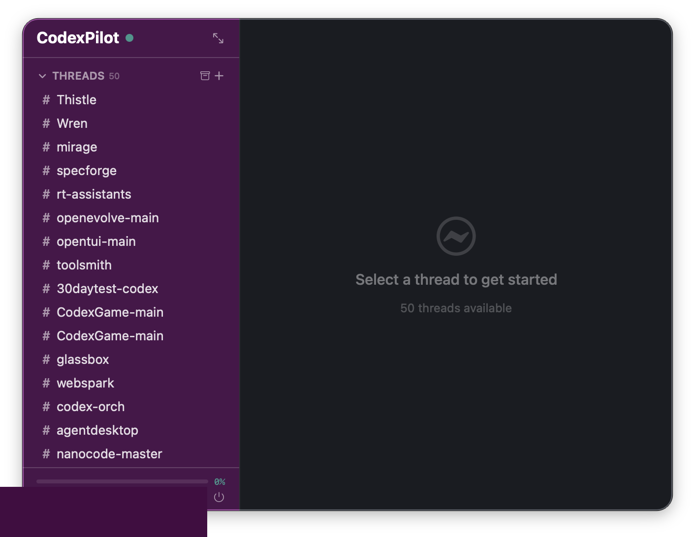

# CodexPilot

A Slack-styled macOS menu bar dashboard for the OpenAI Codex app server. Two-column layout with aubergine sidebar and dark content area — connects via WebSocket to show live threads, fairy agents, turn activity, rate limits, and account info. Also opens as a standalone window.



## Why it exists

The Codex app server (`codex-app-server`) is a powerful JSON-RPC 2.0 backend for AI coding agents, but its primary client is the VS Code extension. CodexPilot gives you a lightweight, always-visible Slack-like interface into what Codex is doing: threads appear as channels in a sidebar, fairies as direct messages, events as a dedicated channel — all with the familiar dark theme and two-column layout. You can create, rename, archive/unarchive threads, summon fairy agents, and send prompts directly from the menu bar or a popout window.

## Install

```bash
# Compile
cd CodexPilot
swiftc -parse-as-library -o CodexPilot CodexPilot.swift

# Create .app bundle (hides dock icon)
mkdir -p CodexPilot.app/Contents/MacOS
cp CodexPilot CodexPilot.app/Contents/MacOS/

# Launch
open CodexPilot.app
```

Or run directly: `./CodexPilot`

## Quickstart

1. Start the Codex app server with WebSocket transport:
   ```bash
   codex-app-server --listen ws://127.0.0.1:8080
   ```

2. Launch CodexPilot (menu bar icon appears as `Codex`)

3. Click the menu bar icon — a 660px two-column panel appears with aubergine sidebar + dark content area

4. Click **Connect** in the sidebar header

5. Threads populate in the THREADS section, fairies in the FAIRIES section

6. Click any `#thread` to see Slack-style messages with avatars and sender names in the content area

7. Click the popout button (↗) in the sidebar header to open a 900x600 standalone window

## Features

### Slack-like redesign (v0.5.0)
- **Two-column layout** — 220px aubergine sidebar + dark content area (660px menu bar panel, 900x600 popout window)
- **Sidebar navigation** — collapsible THREADS and FAIRIES sections with `+` buttons, `#events` channel, workspace header with connection status
- **Channel-style threads** — threads shown as `#channel-name` rows with blue highlight on selection, red badge for active turns
- **Fairy DM rows** — presence dot (color-coded by state), fairy emoji + name, activity spinner for working fairies
- **Slack-style messages** — flat rows with 36px avatars, bold sender names, timestamps. No chat bubbles — clean, scannable layout
- **Command blocks** — monospace terminal output with dark background, exit code badges
- **File attachments** — file changes shown as clickable file icons with names
- **Composer** — rounded border input like Slack: "Message #threadname..." placeholder, send/stop button
- **Popout window** — standalone 900x600 window sharing state with menu bar panel. Changes sync both ways
- **Content router** — empty state, thread detail, fairy garden, and event log views in the content area
- **Inline summon** — `+` on FAIRIES section reveals inline text field for summoning fairy agents
- **Dark theme** — full Slack aubergine + dark content color scheme throughout

### Fairy Garden (v0.4.0)
- **Spatial canvas** — fairy agents displayed as animated orbs on a dark gradient with star particles
- **Fairy summoning** — type a task to summon a new fairy (creates thread + sends prompt with low effort)
- **Identity system** — deterministic names, emojis, and colors generated from thread IDs
- **State tracking** — fairies pulse when active (thinking/working/waiting), burst on completion, dim when idle

### Thread lifecycle + Account (v0.3.0)
- **Create threads** — click `+` in THREADS section to create via `thread/start`
- **Archive / Unarchive** — archive icon toggle in sidebar, archive button in content header
- **Inline rename** — click thread name in content header to edit
- **Account info** — plan badge and email in sidebar footer
- **Rate limit gauge** — color-coded bar in sidebar footer with percentage and reset time

### Thread detail (v0.2.0)
- **Turn history** — complete turn history with typed Slack-style message rows
- **Item types** — user messages, agent messages, command executions, file changes, reasoning, plans, MCP tool calls
- **Streaming** — agent responses stream in real-time with spinner
- **Auto-approval** — automatically approves command and file change requests

### Core (v0.1.0)
- **WebSocket connection** — raw TCP WebSocket client (avoids permessage-deflate rejection)
- **Auto-reconnect** — reconnects every 5 seconds on disconnect
- **10-second refresh** — polls thread list, loaded threads, and rate limits

## Examples

### Two-column dashboard
Click the menu bar icon to see the Slack-style layout: aubergine sidebar with your threads and fairies on the left, message content on the right.

### Open in a window
Click the ↗ popout button in the sidebar header to open a 900x600 standalone window. Both views share the same connection — actions in one reflect in the other.

### Summon a fairy agent
Click `+` next to FAIRIES in the sidebar. Type a task in the inline field and press Enter. A new fairy appears with a unique name and emoji, and starts working immediately.

### Send a prompt
Select a `#thread` in the sidebar, type in the composer at the bottom ("Message #threadname..."), and press Enter. The response streams in as Slack-style messages.

### View events
Click `#events` in the sidebar to see a chronological log of all server notifications — turn starts/completions, approval requests, token usage updates, errors.

## Protocol Methods Used

| Method | Direction | Purpose |
|---|---|---|
| `initialize` | Client -> Server | Handshake with clientInfo |
| `thread/list` | Client -> Server | List threads (with optional `showArchived`) |
| `thread/loaded/list` | Client -> Server | List loaded threads |
| `thread/start` | Client -> Server | Create new thread (v0.3.0) |
| `thread/resume` | Client -> Server | Load thread history |
| `thread/archive` | Client -> Server | Archive a thread |
| `thread/unarchive` | Client -> Server | Unarchive a thread (v0.3.0) |
| `thread/name/set` | Client -> Server | Rename a thread (v0.3.0) |
| `turn/start` | Client -> Server | Send a prompt |
| `turn/interrupt` | Client -> Server | Interrupt active turn |
| `account/read` | Client -> Server | Get account info (v0.3.0) |
| `account/rateLimits/read` | Client -> Server | Get rate limits (v0.3.0) |
| 12 notifications | Server -> Client | Status, turns, items, deltas, tokens, rate limits |

## Testing

### With the mock server
```bash
pip3 install websockets
python3 test_mock_server.py
```
The mock server simulates all v0.3.0 features including thread lifecycle, account info, rate limits with live updates during turns, streaming responses, and approval requests.

### With the real server
```bash
cd codex-rs && cargo build -p codex-app-server
./target/debug/codex-app-server --listen ws://127.0.0.1:8080
```

## Troubleshooting

- **"Invalid URL"** — make sure the address starts with `ws://` or `wss://`
- **"Connection lost"** — the server may have stopped; CodexPilot will auto-reconnect in 5 seconds
- **No threads showing** — threads only appear after `thread/list` returns; click the refresh button
- **Menu bar icon shows dotted circle** — you're disconnected; click and connect
- **Empty detail view** — thread has no turns yet; send a prompt to start one
- **Rate limit not showing** — the server may not support `account/rateLimits/read`; this is optional

## How it works

CodexPilot speaks the same JSON-RPC 2.0 protocol as the VS Code extension:
1. Sends `initialize` with `clientInfo` (name/version)
2. Requests `thread/list`, `thread/loaded/list`, `account/read`, `account/rateLimits/read`
3. Listens for server notifications (`thread/status/changed`, `turn/started`, `turn/completed`, `account/rateLimits/updated`, etc.)
4. On thread click: sends `thread/resume` to load turn history
5. On prompt send: sends `turn/start` with input, then handles streaming `item/agentMessage/delta` notifications
6. Auto-responds to server requests (`commandExecution/requestApproval`, `fileChange/requestApproval`)
7. Refreshes thread list and rate limits every 10 seconds

Uses a custom raw TCP WebSocket client (via NWConnection) to avoid macOS's automatic `Sec-WebSocket-Extensions: permessage-deflate` header that the Codex server's `tokio-tungstenite` rejects.

## Requirements

- macOS 14+ (Sonoma or later)
- Swift 5.9+ / Xcode 15+
- A running `codex-app-server` instance with WebSocket transport

## License

MIT
